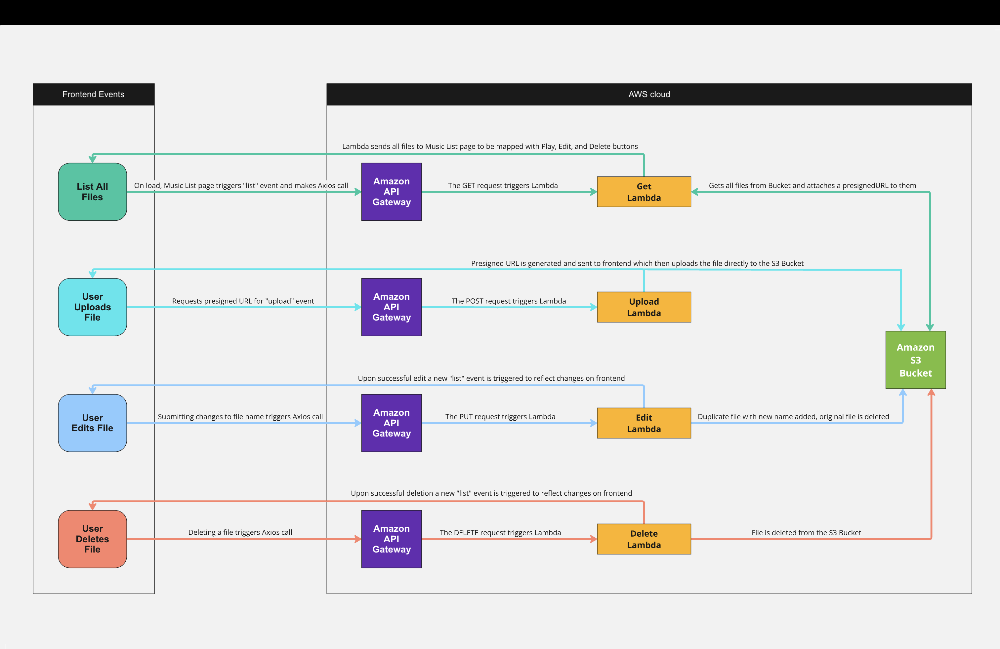
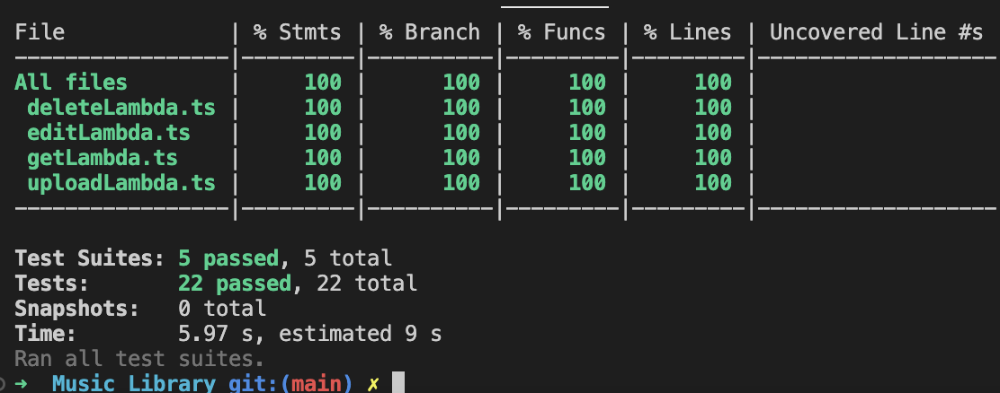

# Music Library Service  

The **Music Library Service** is a serverless application designed to manage MP3 file uploads, retrievals, renaming, and deletions using **AWS Lambda**, **S3**, and **API Gateway**. The infrastructure is built with the **AWS Cloud Development Kit (CDK)**, ensuring an **Infrastructure-as-Code (IaC)** approach for scalable deployment.  

---

## Features  

- **Upload MP3 Files**: Securely upload MP3 files to an S3 bucket via presigned URLs.  
- **Retrieve Files**: Generate presigned URLs for downloading files stored in S3.  
- **List Files**: Fetch a list of all stored MP3 files with their respective download URLs.  
- **Edit File Names**: Rename an existing MP3 file in S3.  
- **Delete Files**: Permanently delete MP3 files from S3.  
- **Secure API Access**: Uses API Gateway with API keys for access control.  
- **Scalable and Serverless**: Built using AWS Lambda and API Gateway for a highly available system.  
- **Infrastructure as Code (IaC)**: Defined using AWS CDK for easy deployment and management.  
- **Comprehensive Testing**: All Lambda functions have unit tests using Jest.  

---

## System Components  

This project is structured with AWS Lambda functions handling different aspects of file management:  

### 1. **UploadLambda**  
- Handles file uploads by checking for duplicate filenames in the S3 bucket.  
- Generates presigned URLs for secure file uploads.  
- Restricts upload requests to MP3 files.  

### 2. **GetLambda**  
- Retrieves a presigned URL for a specific MP3 file.  
- Lists all available MP3 files in S3, including download URLs.  

### 3. **EditLambda**  
- Checks if the new filename already exists before renaming.  
- Uses AWS S3 copy and delete operations to rename a file.  
- Prevents duplicate file names and maintains consistency.  

### 4. **DeleteLambda**  
- Handles the deletion of MP3 files from S3.  
- Ensures proper error handling in case of S3 failures.  
- Implements confirmation handling on the frontend to prevent accidental deletions.  

---

## Architecture Overview  




### **Frontend**  
- React-based UI for file management.  

### **Backend**  
- AWS Lambda functions, API Gateway, and S3.  

### **Infrastructure**  
- AWS CDK for defining and deploying resources.  

### **Workflow**  

#### **Upload a File:**  
1. Frontend requests a presigned URL.  
2. Uploads the file directly to S3.  

#### **Retrieve or List Files:**  
1. Frontend calls the API Gateway endpoint.  
2. **GetLambda** responds with either a single presigned URL or a list of MP3 files.  

#### **Rename a File:**  
1. **EditLambda** checks for duplicates and renames the file in S3.  

#### **Delete a File:**  
1. **DeleteLambda** removes the file from S3 upon confirmation.  

---

## Deployment Instructions  

### **Prerequisites**  
- AWS Account  
- AWS CLI Installed and Configured  
- Node.js and npm  
- AWS CDK CLI Installed  

### **Setup**  

#### **Clone the repository:**  
```sh
git clone https://{repository}
cd {root directory}
```

#### **Install dependencies:**  
```sh
npm install
```

#### **Bootstrap AWS CDK Environment (if not already done):**  
```sh
cdk bootstrap
```

#### **Deploy the stack:**  
```sh
cdk deploy
```

---

## API Endpoints  

The following API Gateway endpoints are available:  

| **Method**  | **Endpoint**              | **Description**                                |
|------------|--------------------------|----------------------------------------------|
| **POST**   | `/uploadMusicResource`   | Request a presigned URL for file upload    |
| **GET**    | `/getMusicResource`      | List all MP3 files with download URLs      |
| **PUT**    | `/editMusicResource`     | Rename an existing MP3 file                |
| **DELETE** | `/deleteMusicResource`   | Delete an MP3 file                         |

**Note:** API requests require an API key, which must be included in the headers.  

---

## Testing  

### **Run Jest Unit Tests**  
```sh
npm test
```

**Note:** All tests are written in Jest and cover Lambda function logic, including S3 interactions.  

---

## Coverage  

This project includes **22 Jest test cases** covering all Lambda functions, ensuring reliability by testing success cases, failures, and edge cases. **All tests are passing**, keeping the system stable and ready for future updates.  



---

## Logging  

All Lambda logs are stored in **AWS CloudWatch**. You can monitor logs with:  
```sh
aws logs tail /aws/lambda/your-lambda-function-name --follow
```

---

## Next version Roadmap  

- **User Authentication**: Implement authentication for API requests and private music libraries.  
- **Database Integration**: Store metadata (e.g., upload date, user info) in DynamoDB.  
- **Optimized Presigned URL Generation**: Modify presigned URL generation to be triggered only when requested, improving efficiency and URL validity for playback, editing, and deletion.

## Long-term Roadmap

- **Synced Annotation**: Implement a timestamp-based annotation system that enables users to add and view time-synced notes for audio files.
- **Collaborative Workspaces**: Enable shared access to audio file libraries, allowing multiple users to manage and interact with the same set of files within a workspace.
- **Shared Annotations**: Extend the synced annotation system to support real-time collaboration, allowing multiple users to view, add, and edit timestamped notes on shared audio files.

---

## Useful commands

* `./buildscript.sh` view buildscript.sh file to see the list of commands this will run
* `npm run build`   compile typescript to js
* `npm run watch`   watch for changes and compile
* `npm run test`    perform the jest unit tests

- From the 'frontend' directory ({root-directory}/FrontendMusicLibrary/frontend):

* `npm start`       run app on localhost:3000
